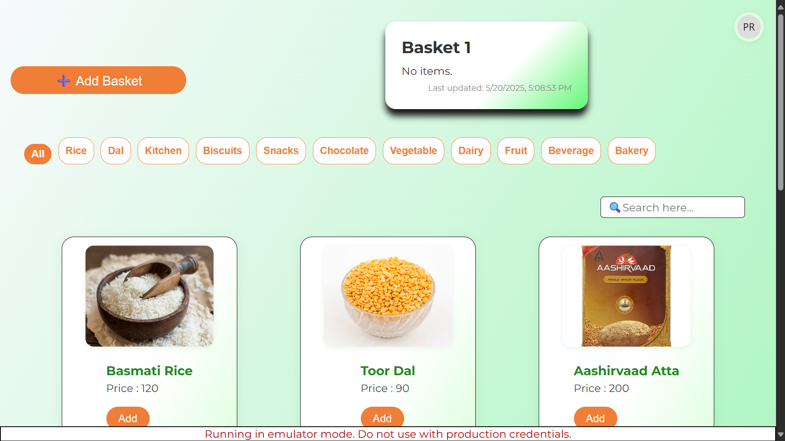

<<<<<<< HEAD
# Grocery Cart App

> Example UI: Basket, type filter cards, and product listing

---
**How to use this project:**
- Filter products by type using the type cards.
- Add items to your basket.
- Responsive and mobile-friendly UI.

---

# React + Vite
=======
Grocery Shopping App
>>>>>>> 7ab35749c9e92e9337bda56456594f76e3327c71

A simple and intuitive grocery shopping app built with ReactJS and Firebase, utilizing local storage for data persistence.

Features
- User-friendly interface for browsing and adding groceries
- Real-time updates using Firebase
- Data persistence using local storage
- Functionalities for adding, removing, and updating grocery items

Technologies Used
- Frontend: ReactJS (useState, useEffect, and other hooks)
- Backend: Firebase
- Storage: Local Storage
- Installation
1. Clone the repository: git clone https://shreyay4060.github.io/grocery/
2. Install dependencies: npm install and bun install 
3. Start the application: bun run dev

Usage
1. Browse the grocery list and add items to your cart
2. View your cart and update quantities or remove items
3. Data will be persisted locally using local storage

Code Structure
The app is structured into the following components:

- App.js: The main application component
- Item .js: Component for displaying the grocery list
- Cart.js: Component for displaying the Baskets
- - firebase.js: Firebase configuration and initialization

Functions Used
- useState: For managing state variables
- useEffect: For handling side effects and data fetching
- addItem, deleteBasket, updateBasket: Functions for managing grocery items

Future Improvements
- Implement user authentication and authorization
- Integrate with a backend API for data storage and retrieval
- Add more features, such as filtering and sorting

Contributing
Contributions are welcome! If you'd like to contribute to this project, please fork the repository and submit a pull request.
